# AmazonReviewsMarketTrends
**(Data Science 5th examination project.)**

 This project combine *sentiment analysis* and *topic modeling* to discover which aspects of a product are driving the overall customers' perception. Starting from a famous Amazon product — one that has a lot of reviews spanning across several years — we want to identify "hot topics" in customer reviews to understand product weaknesses and strengths.

Furthermore, after identifying the topics, in order to enrich the final overview of the product, we will classify them according to their *positivity* and *subjectivity*.

### 👉🏼 [🌐 Jump to the interactive results](https://mrpio.github.io/AmazonReviewsMarketTrends)

### 👉🏼 [📕 Read the thesis](thesis.pdf)

## 📖 Table of Contents
* [⛏️ Scraping Amazon Reviews](#1)
* [🧹 Reviews Text Extractor](#2)
* [📈 Visualizing the ratings trend over time](#3)
* [☁️ Plotting Word Clouds](#4)
* [🔥 Topic Modeling with BERTopic](#5)
* [😮 Sentiment analysis with TextBlob](#6)

## ⛏️ Scraping Amazon reviews
The [`scraper.ipynb`](1-etl/1-scraper.ipynb) notebook is used to scrape reviews of a product on Amazon.

> [!CAUTION]
> This code is intended for **educational and research purposes only**. The use of this code to scrape Amazon may violate their [Terms of Service](https://www.amazon.com/gp/help/customer/display.html?nodeId=508088) and could lead to legal consequences.
> By using this script, you agree that you understand these warnings and disclaimers.

### Getting the URL
The `get_url` function returns the URL of a page containing 10 reviews of the given product with the given number of stars. 

> [!NOTE]
> This script was tested to work on January 16, 2025. As you know, web scraping depends on the website, which evolves over time. In the future, `get_url` may not return the correct URL.

With a given filter configuration, Amazon limits the number of pages to 10. So I decided to filter by the number of stars. If available, this script will collect 500 reviews, 100 1-star reviews, 100 2-star reviews, and so on.

> [!IMPORTANT]
> Amazon requires the user to be logged to view the reviews dedicated page. Therefore, you need to login with your browser and export your cookies, as a JSON file in the `/1-etl` directory. I used [*Cookie-Editor*](https://cookie-editor.com/) to do so.

## 🧹 Reviews Text Extractor
The [`cleaner.ipynb`](1-etl/2-cleaner.ipynb) notebook is used downstream to the scraping algorithm to extract the text of the reviews from the `html` bodies. Using the handy *BeautifulSoup* library, the `HTML` bodies are parsed and the 10 reviews are extracted from each page. For each review sample, we store the title, the content, and the stars.

> [!NOTE]
> As previously noted, this operation is highly dependant from the Amazon HTML page code, which surely will change over time. Currently the pertinent fields are retrieved using the class of the parent of the `` tag that contains the text.

## 📈 Visualizing the ratings trend over time
The [`ratings_over_time.ipynb`](2-data_visualization/1-ratings_over_time.ipynb) notebook is used to visualize the dataset of ratings by plotting them month by month and showing the distribution of stars, i.e. the level of polarization of customers, over time.

From the monthly ratings plot, we can see that there are two peaks in the number of reviews in the months of January and December 2024. However, this doesn't necessarily mean that sales were particularly high during these periods, since the scraping process selected only the most relevant reviews, regardless of time uniformity.

    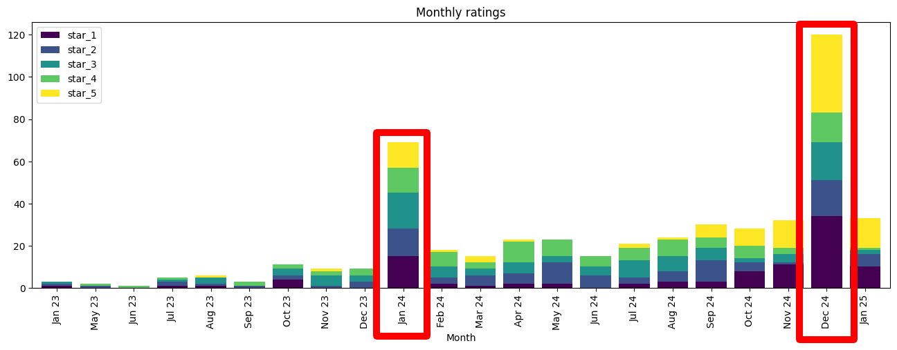</img>

When we stack the bars, we see that the polarization of reviews increases over time. This means that customers are strongly disagreeing with each other.

    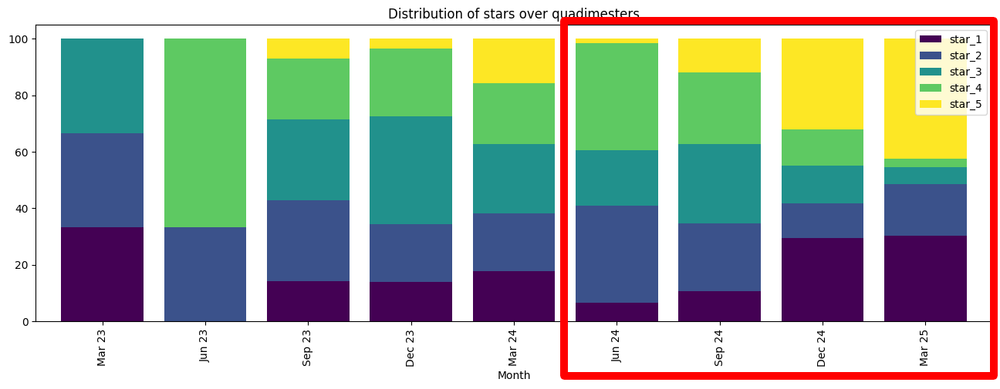</img>

## ☁️ Plotting Word Clouds
The [`word_clouds.ipynb`](2-data_visualization/2-word_clouds.ipynb) notebook aims to show the most common words in both the titles and the content of the reviews. First, we analyze the 5-star reviews to identify the aspects that customers appreciate the most. Then the same process is repeated for the 1-star reviews.

This serves as a preamble to the Topic Modeling analysis that will follow.

    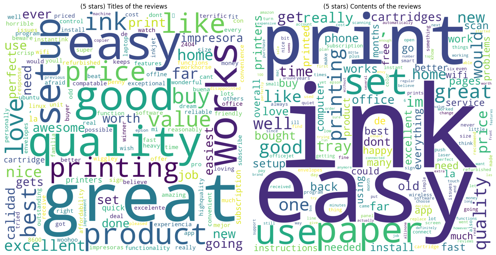</img>

The most frequent words in the 5-star reviews are *easy, quality, price, new, in-time* and *office*

    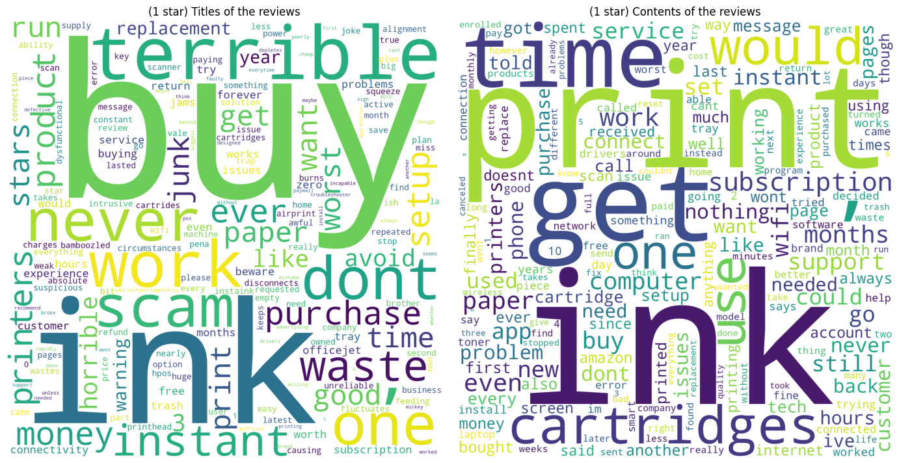</img>

The most frequent words in the 1-star reviews are *ink, cartridges, waste, scam, disconnects, paper, setup, subscription, wifi, support* and *app*.

## 🔥 Topic Modeling with [BERTopic](https://github.com/MaartenGr/BERTopic)
The [`topic_modeling.ipynb`](3-topic_modeling/topic_modeling.ipynb) notebook performs the Topic Modeling task using BERTopic. The 500 collected reviews are clustered into semantically similar groups. From these clusters, topics are extracted and a probability distribution over the topics is calculated on the basis of the distances between the groups.

### How BERTopic works
Topic Modeling is an *unsupervised* task to classify a collection of documents. The classical algorithm to solve it is LDA. LDA uses the *Bag of Words* embedding to count the frequency of words in the documents. In its base version, **LDA is not contextual aware**.

In 2016, Christopher Moody, in its paper [*Mixing Dirichlet Topic Models and Word Embeddings to Make lda2vec*](http://arxiv.org/abs/1605.02019), devised [`lda2vec`](https://github.com/cemoody/lda2vec), a tool that extends standard LDA with *Word2Vec* embedding **to capture static semantics**.

In 2020, Dimo Angelov published the paper [*Top2Vec: Distributed Representations of Topics*](https://arxiv.org/abs/2008.09470). The paper introduces a new method that changes the prospective of the LDA probabilistic algorithm. The *Top2Vec* model basically performs clustering downstream of the common document and word semantic embedding. In its original form, however, it did not take advantage of modern transformers and was thus limited to static semantics.

In 2022, Maarten Grootendorst authored the paper [*BERTopic: Neural topic modeling with a class-based TF-IDF procedure*](https://arxiv.org/abs/2203.05794), releasing [`BERTopic`](https://github.com/MaartenGr/BERTopic). The idea behind BERTopic is to use modern BERT-like transformers instead of the less recent *Word2Vec*, *Doc2Vec* and *Bag of Words* embeddings.

BERT transformers excel in capturing contextual semantic. This means that the same word, in two different contexts, with two different meanings — e.g. the "bank" that holds your money and the "bank" of a river — **is assigned to two different embedding vectors**. In the language of transformers, this is called the *attention mechanism*.

More specifically, Sentence Transformers, also known as *SBERT*, are what are used here. SBERT models extend the basic BERT models with the ability to embed entire documents along with their individual words.

*BERTopic* defines a precise workflow, divided into 4 main phases. The `BERTopic' class adopts the CBDP philosophy: in each phase we can use one between different components.

</img>

#### The embedding phase
The documents in the corpus — in our case, the 500 reviews — are encoded into low-dimensional dense vectors using a transformer. Any model from the *SBERT* library can be used to do so. [Here](https://www.sbert.net/docs/sentence_transformer/pretrained_models.html) a table shows the different available models, ranked by their performance and size.

One thing we should be aware of is the *Max Sequence Length* model attribute. If we have documents that are too long, the content will be truncated and potentially useful information will be lost. **So we can either split the documents into smaller documents** — That's what we did here — **or choose a larger model**.

> [!TIP]
> In my experience, I strongly recommend splitting large documents into sentences using a tokenizer such as `sent_tokenize` from `nltk`. This also has the advantage of naturally assigning multiple topics to a large document.

Another aspect to take into account is the language. If our corpus contains a lot a significant amount of words or even entire documents in a non-english language, we should use a multi-lingual model, like [`paraphrase-multilingual-mpnet-base-v2`](https://huggingface.co/sentence-transformers/paraphrase-multilingual-mpnet-base-v2). However, this is not the case in this project because we scraped the reviews from Amazon US.

We chose [`all-mpnet-base-v2`](https://huggingface.co/sentence-transformers/all-mpnet-base-v2). It encodes documents along 768 dimensions and it's one of the best performing models.

#### The dimensionality reduction phase
As we know, all machine learning algorithms suffer from the curse of dimensionality. Clustering algorithms are particularly sensitive to this, so it's good practice to apply dimensionality reduction methods, like *PCA*, *LDA*, *SVD* or *UMAP* prior to clustering analysis.

However, reducing the embedding space too much could damage the compositional structures that provide semantic distinction between different topics. **Therefore, there is a need for a balance between the quality of the embedding space and the efficiency of the clustering algorithm**.

We used the UMAP algorithm and empirically, we chose 10 output dimensions. UMAP preserves a lot of local structures even in lower-dimensional space, and thus works well with density-based clustering algorithms [[1]](https://towardsdatascience.com/topic-modeling-with-bert-779f7db187e6).

#### The clustering phase
Now that the embedding dimensions have been reduced, documents are clustered by similarity. Density-based algorithms work very well at this stage because they don't force data points into clusters, but instead treat them as outliers.

*HDBSCAN* is a scale-invariant version of *DBSCAN*, which means it can handle clusters with different densities and does not require hyperparameter tuning when the points are scaled. It is the *BERTopic* default, so we decided to use it.

    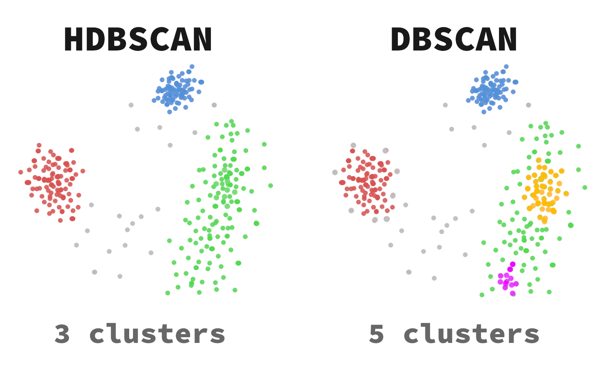</img>

#### The topic extraction phase
Once the clusters have been determined, we need to interpret them. The set of documents contained in each cluster makes the model of a density-based clustering algorithm, but we can't understand what the topics are just by looking at the points, since **we ignore the meaning of the reduced embedding space**.

This phase is articulated in three steps: *tokenization of topics*, *weighting of tokens* and *keywords extraction*. Here we assume that the *Bag of Word* embedding is used for the 1st phase, while the *TF-IDF* is used for the 2nd phase and *KeyBERT* is used for the 3rd. Tokenize the clusters means to extract words, or n-grams from their documents. 

> [!TIP]
> The `n_gram_range` attribute of `BERTopic` can be used to use n-grams instead of single words to define a topic. This can be very useful in terms of interpretability.

This way, the document-term matrix (DTM) is built.

> [!NOTE]
> *LDA* builds the document-term matrix in the same way. The difference is that in *BERTopic* this is done after identifying the topics in order to interpret them, while in *LDA* it is done in order to find them.

Once the DTM has been extracted, *TF-IDF* is used to adjust the token frequencies to reflect the importance of tokens within a topic, relative to the overall corpus. Actually, *c-TF-IDF*, a variant of the classic *TF-IDF*, is used here. In essence, ***c-TF-IDF* is an application of *TF-IDF* to the union of all the documents in a cluster** — the *meta-document*. This makes sense, since we are looking for n-grams that distinguish a topic, not a document, from all other topics.

> [!NOTE]
> *TF-IDF* gives weight to more frequent words than to less frequent ones, but excludes very common words on the assumption that they are most likely stop words, such as articles and prepositions.

Finally, *KeyBERT* is used to ensure that the selected n-grams are not only relevant in TF-IDF terms, but also semantically meaningful with respect to the *meta-document*.

    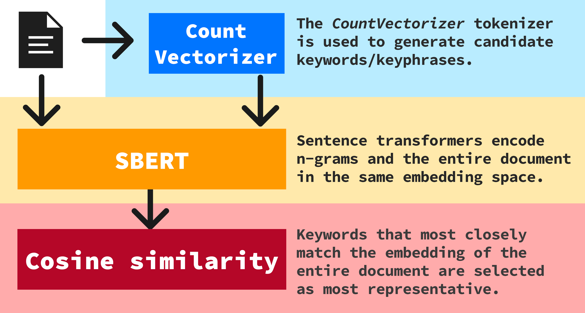</img>

#### The post-processing phase
This is where the unsupervised algorithm ends. The user should now polish the results by *naming*, *reducing*, *merging*, and *visualizing* topics. BERTopic has several amazing tools for interpreting the results. We will use some of them in the following.

### Pre-processing
Before feeding the 500 collected reviews into *BERTopic*, we should consider a few issues.
- **Long 5-star reviews are sometimes paid**. We could solve this problem by filtering out 5-star reviews that are longer than a certain number of words. However, since the goal of the analysis is to determine which aspects of a product drive overall customer perception, and since we selected the most influential reviews, we decided to ignore this fact.
- **Some reviews are very long**. We solved this problem by splitting all the reviews into sentences. The original dataset of 500 reviews became a dataset of 2821 sentences.

    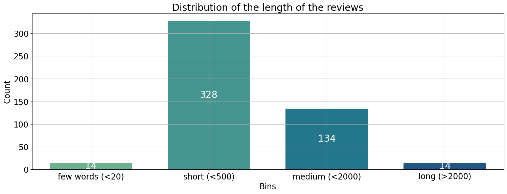</img>

- **Some of the reviews are outliers**. In the datasets there were a few amount of reviews that were removed. As shown in the previous figure, 14 reviews are shorter than 20 characters and were safely removed. In addition, there was a Spanish review that caused the BERTopic model to define a cluster just for that review, since an English-only tokenizer was chosen.

The obtained model is [`model.bertopic`](/3-topic_modeling/model.bertopic). It is the result of several attempts with multiple hyperparameter configurations. As the documentation states, BERTs is stochastic, so running the code multiple times may produce different results.

>[!TIP]
>It is highly recommended to use the GPU if available. Both the embedding phase with the SBERT model and the fitting of the BERTopic were dramatically faster with my *RTX 3070*. You can use `torch.cuda.is_available()` to check the availability of the CUDA toolkit.

### Post-processing
BERTopic extracted 54 topics plus one "outlier" topic. The latter is conventionally assigned id -1 and is the result of all sentences that *HDBSCAN* could not classify as either core or boundary.

#### Merging similar topics
Some of the 54 topics can be merged because they are semantically very close sentences. The merging decision can be seen in [`raw_topics.txt`].(/3-topic_modeling/raw_topics.txt).

The `BERTopic`'s `merge_topics` method was thus called accordingly. This method also requires the training corpus, because once two topics have been merged, the *c-TF-IDF* score must be recomputed because the *meta-document* has changed.

This results in the 54 topics being reduced to 40. The post-processed model is [`model_postprocessed.bertopic`](/3-topic_modeling/model_postprocessed.bertopic).

#### Naming the topics
For the sake of clarity, the remaining 40 topics have been assigned custom labels. The interpretation was on the basis of the extracted n-grams and the most relevant sentences in the cluster.

    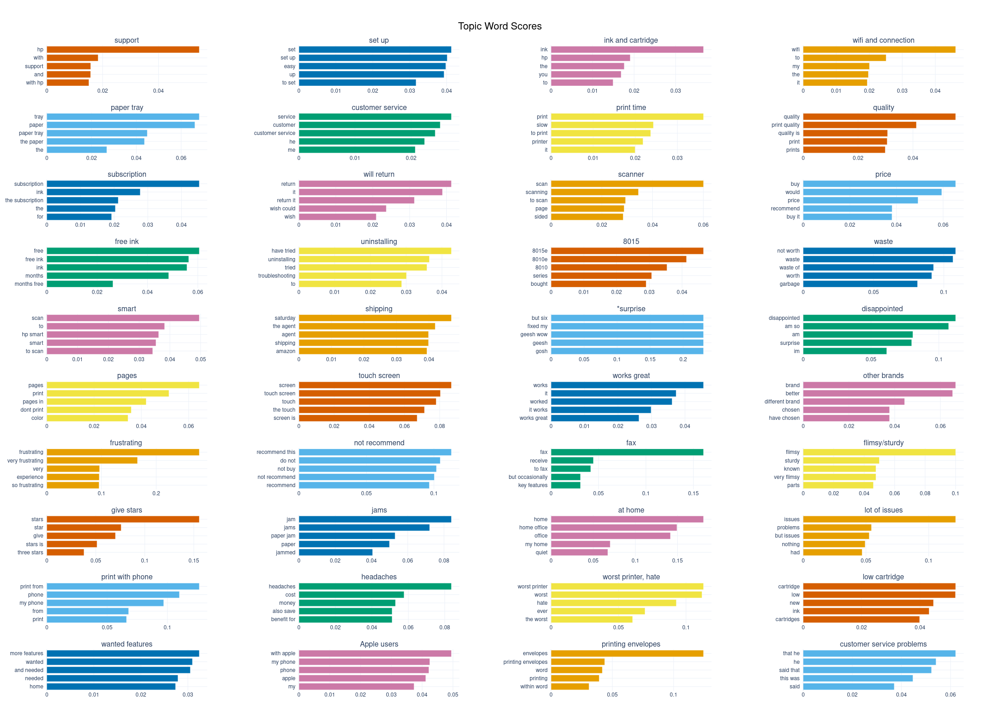</img>

    <a href="https://mrpio.github.io/AmazonReviewsMarketTrends/"><b>➡️ Interactive version</b></a>

### The results
The final results are shown in the following map.

    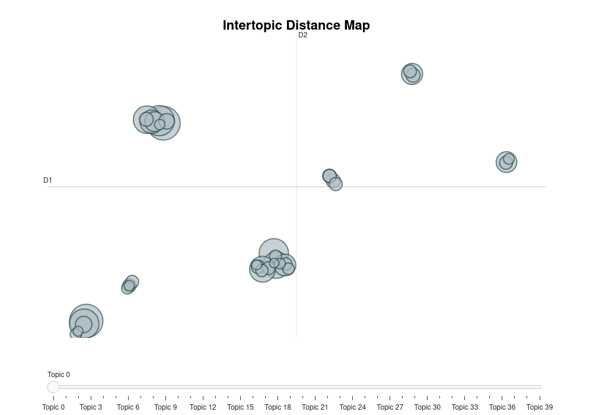</img>

    <a align="center" href="https://mrpio.github.io/AmazonReviewsMarketTrends/"><b>➡️ Interactive version</b></a>

For visualization, the 10 UMAP dimensions are further collapsed into 2 axes. This results in some of the topics overlapping. However, we can clearly see that semantically distant topics reside on distant islands.

The following matrix, shows the correlation between each pair of topics. The distance between topics is not uniform. For example, the topics "ink and cartridge" and "low cartridge" have a correlation value greater than 0.8, as one might expect.

    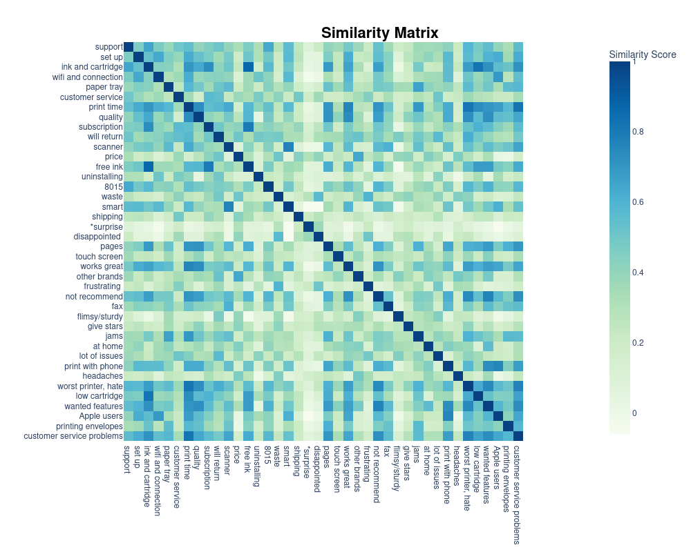</img>

    <a align="center" href="https://mrpio.github.io/AmazonReviewsMarketTrends/"><b>➡️ Interactive version</b></a>

#### Calculating the topic distribution
If we select a particular sentece, we can display the probability distribution over the topics. Consider the following document.

> Once again I am unable to print anything. It is very hard to take customer service reps and their supervisors seriously when they contradict themselves don't listen to you and don't execute on their promises. In general, I think they have a serious attitude problem in customer service.

We can see that the customer has had a difficult time with HP customer service. So it come to no surprise that the topic with greater confidence is "customer service".

    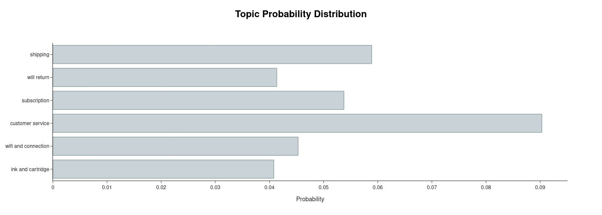</img>

    <a align="center" href="https://mrpio.github.io/AmazonReviewsMarketTrends/"><b>➡️ Interactive version</b></a>

However, one might wonder which part of the sentence contributed the most to determining the probabilities of the topics.

The `approximate_distribution` method uses a sliding window to estimate the similiarity of each token, and its neighbourood, with each topic.

    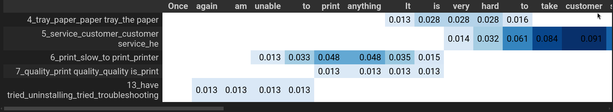</img>

    <a align="center" href="https://mrpio.github.io/AmazonReviewsMarketTrends/"><b>➡️ Interactive version</b></a>

#### Visualizing the topics
The following two-dimensional map shows the final clustering analysis. In the interactive version, we can move the mouse over the points to see the reviews related to a topic.

    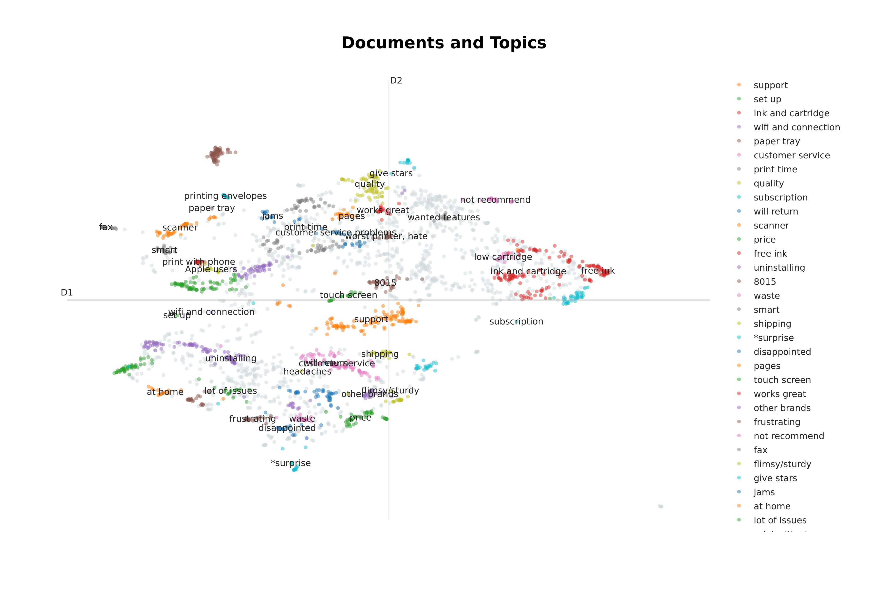</img>

    <a align="center" href="https://mrpio.github.io/AmazonReviewsMarketTrends/"><b>➡️ Interactive version</b></a>

#### Why is it useful?
This last interactive chart can save a lot of time for managers who want to improve the product. There's no need to go through all the reviews one by one; they're collected and organized according to their importance.

The manager should just decide which topic seems more interesting to him. If they want to know if HP's customer service is doing its job well enough, they can take a look at the items within the respective cluster.

The sentences more or less agree on the unhelpful experience they've had with the help.

As for the mobile app, customers are largely satisfied, although someone is annoyed by the frequent login requests.

## 😮 Sentiment analysis with [TextBlob](https://textblob.readthedocs.io/en/dev/)
The [`sentiment_analysis.ipynb`](4-sentiment_analysis/sentiment_analysis.ipynb) notebook organizes the previously found topics in a polarity x subjectivity matrix. To obtain these values, the representative documents in each topic are analyzed and the results are averaged.

To determine the sentiment of the topics, we computed the average *polarity* and *subjectivity* over all the most representative docs that BERTopic has extracted from each cluster in the `get_topic_info` method.

    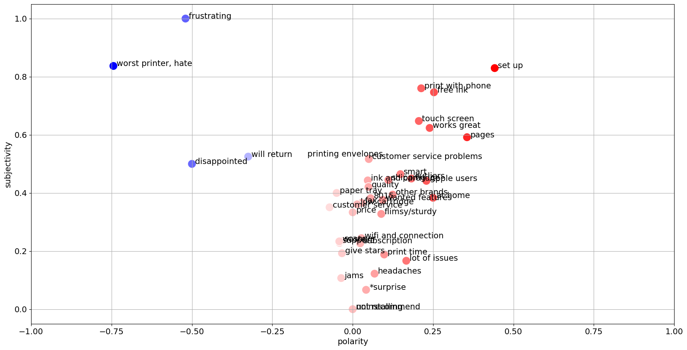</img>

The information shown in the chart can be used togheter with what has been said above to identify the most critical aspects of the product.

Once again, we see that the customer service issue receives a slightly negative average polarity, while the ability to print with the phone is generally appreciated, with an average polarity of almost 0.25.